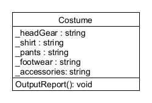

# Abstraction lecture notes

Because of yesterday's Civil Rights holiday, section 4 students (Tues+Thurs 9-10am) have both class sessions with me this week, but my section 5 students (Mon+Wed 12:45-1:45pm) will only see me tomorrow (Wednesday). Section 5 students: my lecture notes are below. Section 4 students: you can have them too! All students: please *finish* your W03 Prepare: Learning Activity before class begins on Wednesday/Thursday. Also, please review these lecture notes, so that we can get started right away on your team activity. - Bro. Gibbons

## Simulations

**Object Oriented Programming**'s original purpose was *simulation* software -- simulate a real-world situation virtually, without suffering the associated real world risks and costs. A few examples:

* Spreadsheets (VisiCalc or Microsoft Excel): simulate a business plan by changing values in a spreadsheet and see how the changes affect "the bottom line." Try lots of different values for costs, price-points, inventory, and whatever else. But try it safely on the spreadsheet first, because in the real world, bankruptcy can happen if your numbers don't work out right!
* Machinery (construction equipment, vehicles, aircraft): learn to operate a heavy machine using a simulator, instead of learning on real-world equipment where there is risk of injury or death.
* Video games: battle your favorite space aliens, consequence-free! We don't do that in the real-world, because space-alien fantasy is absurd, and real-world violence has almost unbearable consequences.
  * > By the way, gaming addiction is a thing. If you or someone you know suffers from any addiction (video games, substance abuse, pornography, gambling, eating, not eating, social media, etc.) please -- don't indulge in shame, don't lose hope, and ASK for HELP!

## Principles

Four object-oriented principles: **Abstraction**, **Encapsulation**, **Inheritance**, **Polymorphism**. They're interrelated. You won't fully understand any until you understand them all, but we have to start somewhere.

### Abstraction example

Let's analyze the things that make up a real-world situation, in a way that can be modeled with software. Illustrative example: Costume shop! *(Why? Maybe for an epic Halloween party? Maybe a film director needs outfits for actors?)* Suppose somebody needs these particular costumes: detective, nurse, snorkeler, cowboy, and bagpiper. Let's analyze this "real world" situation. The costume shop wants software that reports the costume pieces that they need to obtain. What exactly is needed?

- Detective: fedora, trenchcoat, slacks, wingtip shoes, magnifying glass.
- Nurse: surgical mask, scrubs, orthopedic sneakers, clipboard, stethoscope.
- Snorkeler: goggles, wetsuit, flippers/fins, snorkel.
- Cowboy: cowboy hat, flannel long-sleeved buttoned shirt, - jeans, boots with spurs, lasso rope.
- Bagpiper: glengarry bonnet, vest, tartan kilt, ghillie brogues, sporran, bagpipes.

### Design

Each of these costumes has five things in common: head covering, upper and lower garment, footwear, and accessories. Those will be the **attributes** of a Costume data type (or **class**). The only behavior the costume shop needs from our simulator is to output a report. We can model these attributes and behavior **abstractly** with a Unified Modeling Language (UML) **class diagram**:



A class diagram is a large rectangle composed of three vertically stacked rectangles: the name of the class in the top rectangle, its attributes in the middle, and behaviors in the bottom. The data types of each attribute and the data type produced by each behavior are shown after a colon **:** character.

*Synonyms*: object-oriented attributes are also called **member variables**, and behaviors are also called **member functions**, because that's what they are. They're the same as the variables and functions you have already learned to code, except that they belong to a "miniature program structure" called a **class**. *More synonyms*: in C#, attributes are called **fields**, and behaviors are called **methods**. Again, these are just variables and functions, but they only belong to a class of objects. The recommended convention for naming fields is `_underscoreCamelCase` -- prefix with underscore, concatenate capitalized words after the first. This distinguishes class attributes from regular variables in your code. In this Costume example, we chose _shirt and _pants as our meaningful attribute names. They're simpler and more convenient to type than _upperGarment and _lowerGarment, and they match close enough to some of our costume pieces, even if they're not exact.

### Implementation

Here is our C# code that implements the Costume data type:

```C#
​namespace Costume;

class Costume
{
    // attributes
    public string _headGear;
    public string _shirt;
    public string _pants;
    public string _accessories;
    public string _footwear;

    // behaviors
    public void OutputReport()
    {
        string result;
         result = $"Head covering: {_headGear}, Upper garment: {_shirt},\n";
        result += $"Lower garment: {_pants}, Footwear: {_footwear},\n";
        result += $"Accessories: {_accessories}\n";
        Console.WriteLine(result);
    }
}
```

For the sake of proper version control, you must put this code into its own file named `Costume.cs`. I chose to create another sandbox project named Costume, by opening a terminal and typing these two command lines:

```shell
​cd sandbox
dotnet new console -o Costume --use-program-main
cd Costume
```

Then I created a new file Costume.cs in the Costume subfolder and put the Costume class code there.

An object is an instance of a class. Repeat: an **object** is an **instance** of a **class**. Say it louder so your roommates can hear you: an **object** is an **instance** of a **class**! (Thanks.)

Now that we have our "miniature program structure" for costumes, lets make and use some **objects** (that is, some **instances** of costumes) in Program.cs:

```C#
​namespace Costume;

class Program
{
    static void Main(string[] args)
    {
        Costume detective = new Costume();
        detective._headGear = "fedora";
        detective._shirt = "trenchcoat";
        detective._pants = "slacks";
        detective._footwear = "wingtip shoes";
        detective._accessories = "magnifying glass";

        Costume nurse = new Costume();
        nurse._headGear = "surgical mask";
        nurse._shirt = "scrubs";
        nurse._pants = "scrubs";
        nurse._footwear = "orthopedic sneakers";
        nurse._accessories = "clipboard, stehoscope";

        Costume snorkeler = new Costume();
        snorkeler._headGear = "goggles";
        snorkeler._shirt = "wetsuit";
        snorkeler._pants = "wetsuit";
        snorkeler._footwear = "flippers";
        snorkeler._accessories = "snorkel";

        Costume cowboy = new Costume();
        cowboy._headGear = "cowboy hat";
        cowboy._shirt = "flannel button-up";
        cowboy._pants = "jeans";
        cowboy._footwear = "boots with spurs";
        cowboy._accessories = "leather gloves, lasso rope";

        Costume bagpiper = new Costume();
        bagpiper._headGear = "glengarry bonnet";
        bagpiper._shirt = "vest";
        bagpiper._pants = "tartan kilt";
        bagpiper._footwear = "ghillie brogues";
        bagpiper._accessories = "sporran, bagpipes";

        detective.OutputReport();
        nurse.OutputReport();
        snorkeler.OutputReport();
        cowboy.OutputReport();
        bagpiper.OutputReport();
    }
}
``` 

Build the program:

```shell
​dotnet build
```

Then run the program:

```shell
​dotnet run
```

The program outputs the Costume shop's desired report:

```text
​Head covering: fedora, Upper garment: trenchcoat,
Lower garment: slacks, Footwear: wingtip shoes,
Accessories: magnifying glass

Head covering: surgical mask, Upper garment: scrubs,
Lower garment: scrubs, Footwear: orthopedic sneakers,
Accessories: clipboard, stehoscope

Head covering: goggles, Upper garment: wetsuit,
Lower garment: wetsuit, Footwear: flippers,
Accessories: snorkel

Head covering: cowboy hat, Upper garment: flannel button-up,
Lower garment: jeans, Footwear: boots with spurs,
Accessories: leather gloves, lasso rope

Head covering: glengarry bonnet, Upper garment: vest,
Lower garment: tartan kilt, Footwear: ghillie brogues,
Accessories: sporran, bagpipes
```
